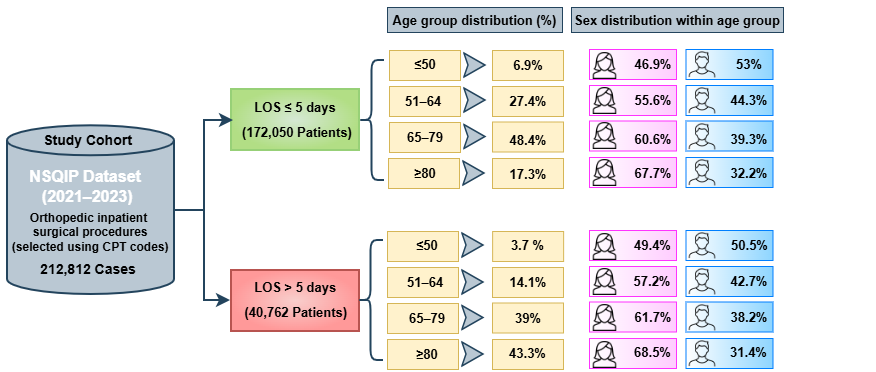
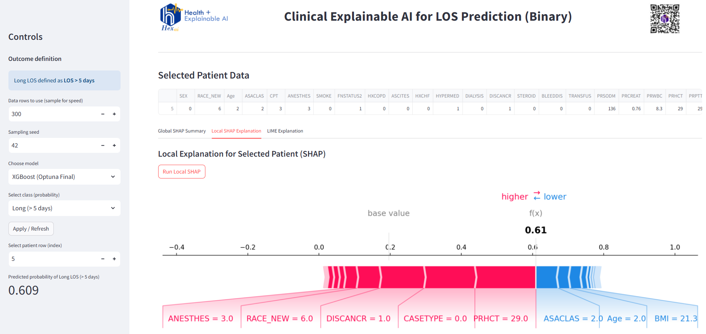
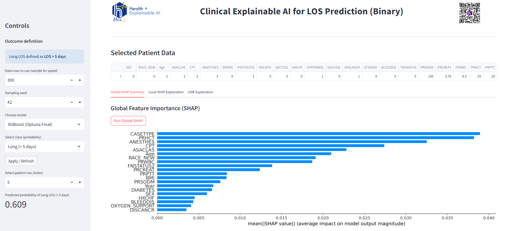
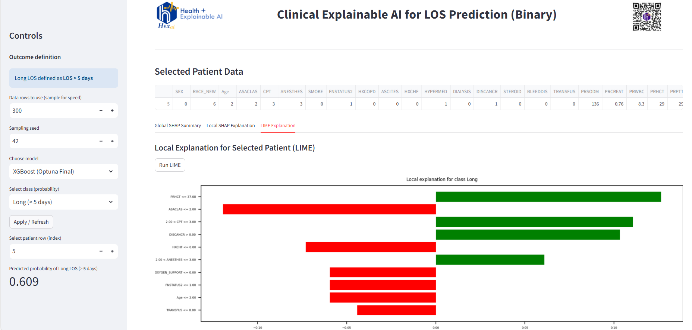

# Trustworthy-XAI-for-LOS-Prediction-in-Orthopedic-Surgery

Trustworthy and explainable AI framework for predicting hospital length of stay (LOS) following orthopedic inpatient surgery.

## Table of Contents
- [Abstract](#abstract)
- [Directory Descriptions](#directory-descriptions)
- [The Proposed Computational Pipeline](#the-proposed-computational-pipeline)
- [Explainable AI: Clinical App Interface](#explainable-ai-clinical-app-interface)
- [Data Availability](#data-availability)
- [Publications](#publications)
- [Acknowledgments](#acknowledgments)
- [Citation](#citation)

### Abstract

This GitHub repository contains the full implementation of a trustworthy, uncertainty-aware, and explainable artificial intelligence (AI) framework for predicting prolonged hospital length of stay (LOS) following orthopedic inpatient surgery.

Hospital LOS was formulated as a binary classification task using a clinically motivated cutoff of five days (LOS ≤ 5 vs. LOS > 5 days). The framework relies exclusively on preoperative patient demographics, comorbidities, laboratory values, and procedural characteristics derived from the American College of Surgeons National Surgical Quality Improvement Program (ACS-NSQIP) database (2021–2023).

The proposed approach integrates machine learning–based risk prediction with uncertainty quantification, calibration analysis, algorithmic fairness assessment across age, sex, and race subgroups, and explainability using SHapley Additive exPlanations (SHAP) and Local Interpretable Model-Agnostic Explanations (LIME). The resulting framework is designed to support transparent, equitable, and clinically actionable decision-making in orthopedic surgery.

### Directory Descriptions
- 
<strong>Code:</strong> Python scripts and Jupyter notebooks for data preprocessing, model training, cross-validation, performance evaluation, uncertainty analysis, fairness assessment, and explainability.

- 
<strong>Dataset:</strong> Description files documenting the structure and variables of the ACS-NSQIP dataset used in this study. Raw clinical data are not included due to data use restrictions.

- 
<strong>Figures:</strong> Figures and visualizations generated for the study, including SHAP summaries, local explainability plots (SHAP and LIME), cohort characteristics, and application screenshots.

- 
<strong>Models:</strong> Trained machine learning models (including the optimized XGBoost model) and related configuration files.

### The Proposed Computational Pipeline

  

The computational pipeline consists of cohort construction from the NSQIP registry, preoperative feature extraction, binary LOS outcome definition, supervised machine learning model training with five-fold stratified cross-validation, uncertainty quantification via bootstrap confidence intervals, probabilistic calibration analysis, subgroup-level fairness evaluation, and global and local explainability using SHAP and LIME.

### Explainable AI: Clinical App Interface

  

  
  

A clinician-facing decision-support interface was developed using Streamlit to enable interactive exploration of model predictions. The application displays the predicted probability of prolonged LOS together with global feature importance and patient-specific explanations.

The interface supports model selection, patient-level inspection, and visualization of contributing factors, facilitating preoperative risk stratification while preserving clinician oversight and judgment.

### Data Availability

The clinical data used in this study were obtained from the American College of Surgeons National Surgical Quality Improvement Program (ACS-NSQIP).

Due to data use agreements and patient privacy protections, the raw NSQIP dataset cannot be shared publicly. This repository provides all source code, trained models, and documentation necessary to reproduce the analyses for authorized users with appropriate data access.

### Publications
- 

<strong>Trustworthy AI Models for Hospital Length-of-Stay Prediction in Orthopedic Surgery</strong> 
Journal of Orthopaedic Reports, 2025.

### Acknowledgments

The authors gratefully acknowledge the American College of Surgeons and the National Surgical Quality Improvement Program (ACS-NSQIP) for providing access to the clinical dataset used in this research.

### Citation

If you use this repository or any part of this work in your research, please cite:

Rezvani F, Kann M, Myers N, Gupta P, Kashefi A, Hogan MV, Plate JF, Tafti AP. 
<i>Trustworthy AI Models for Hospital Length-of-Stay Prediction in Orthopedic Surgery</i>, 2025.

   
  <b>Pitt Health + Explainable AI (Pitt HexAI) Research Laboratory</b>

